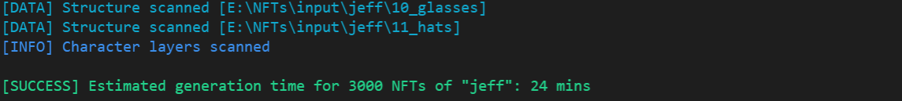
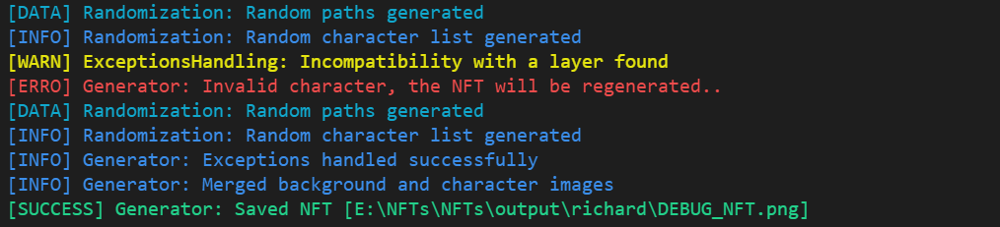

# Advanced NFTs Generator

This tool is made by [Yoratoni](https://github.com/yoratoni) for the [AstroDreamerz](https://astrodreamerz.io/) project.

As we wanted our NFTs to show the whole body of every character, some of our NFTs had more than 11 layers so we definitely needed to create our own generator.

I decided to separate the program into multiple parts:
- The first part concerns the generated list of random paths (Random generation exception handling, etc..).
- The second part to merge the images of the list together and saves the final NFT.
- The third part concerns the preparation for OpenSea, mixing the NFTs/metadata, adding the IPFS, etc.. 

**Why ?** <br />
Because it is a lot more performant to detect exceptions & potential duplicates by checking the paths list
instead of doing that after generating the image (I don't want to destroy my SSD by saving/deleting invalid NFTs 10 times in a row..).


## Technical summary:
  - Comparative hashes system based on the [xxHash](https://github.com/Cyan4973/xxHash) algorithm.
  - Metadata are now generated at the same time as the NFTs.
  - Debug mode that allows to verify an NFT.
  - It now takes ~500ms to generate an NFT (1080x1080).
  - Optional layers & optional layers rarity.
  - Image rarifier that virtually duplicates images (rarity system).
  - Accessories handling (Allows multiple accessories).
  - Exceptions handling (4 different types).
  - [Settings](settings/settings.py) file to edit the main settings.
  - A settings file for every character, check [ElonSettings](settings/elon_settings.py).
  - Type hints, utility classes and docstrings for the functions.
  - Paths verification (done before saving any file).
  - Custom logs system (pyprint & extime).


## The layers structure:
**Note**: I'm always using a number before the name (as VS Code sorts the directories by alphabetic order),
something like `00_backgrounds`, `07_hands` etc.. so all the layers are sorted in the correct order,
the first layer named `00_..` is generally the background, after that comes the face, the clothes etc..  <br />

Check this example:
```
input/
|-- character_0/
|   |-- 00_backgrounds/
|   |-- 01_faces/
|   |-- 02_pants/
|   |-- 03_shirts/
|   |-- 04_jackets/
|   |-- etc..
|
|-- character_1/
    |-- 00_backgrounds/
    |-- 01_faces/
    |-- 02_foobar/
    |-- etc..
```

After that, the name `character_0` and the name `character_1` can be used inside the settings for the main function,
something like `character_directories = ['character_0', 'character_1']`


## Settings
All the main app settings can be modified inside the [settings.py](settings/settings.py) file. The first class called `GlobalSettings` concerns all the main settings such as the main input directory, the name of the characters (character_directories) and other debugging settings.

**NEW:** The character settings are now separated into multiple files, it's a lot more easier like this.
About the character settings: [elon_settings.py](settings/elon_settings.py) for example concerns the first character settings of our NFTs, this class, based on the `CharacterSettings` class allows to define custom parameters per character (exceptions, optional layers, etc..).

After defining your character classes, you need to modify these lines into the [generator.py](https://github.com/ostra-project/Advanced-NFTs-Generator/blob/main/libs/generator.py#L187) file

```py
# Character parameters obtained from the name
if character_name == GlobalSettings.character_directories[0]:
    settings = FirstCharacterSettings
    
elif character_name == GlobalSettings.character_directories[1]:
    settings = SecondCharacterSettings
    
elif character_name == GlobalSettings.character_directories[2]:
    settings = ThirdCharacterSettings
```

_This will be modified later, I want this to be as simple as possible._


## The main function:
The `Generator.generate_nfts()` function, which is the main function, is actually pretty simple to understand.

Arguments:
  - The first argument is the final number of NFTs for the later-defined character.
  - The second argument is the name of the character (Defined inside the `character_directories` list (Check [settings.py](settings/settings.py))
  - [**OPTIONAL**] The `debug_mode_latency` argument is set to 0 by default, if modified, the generator will be in debug mode,
    in this mode, only one NFT is generated, using the name `DEBUG_NFT.png` to check if everything works perfectly fine.
    The value defined in this parameter is the number of sleeping milliseconds between two generated NFTs,
    I'm generally using 2500ms, it's enough to check a whole NFT.
  - [**OPTIONAL**] The last argument (is_saving_system_enabled) is set to True by default, it simply allows you to deactivate the saving system.

This function also integrates an estimated time system, it generates 5 NFTs and calculate the estimated time based on the final number of NFTs, this function is not really accurate because the complexity per NFT fully depends on the incompatibilites and the number of used images, but it gives at least an estimation.




## Handled exceptions:
You can check the [elon_settings.py](settings/elon_settings.py) file to have an example of these exceptions and how they works (It is for the AstroDreamerz project so, it's not really pretty lol)

  - `'ORDER_CHANGE'`: <br />
    Allows you to put an image/layer before another image/layer, the first parameter concerns the name of the layer/image that will go before the layer/image precised by the         second parameter. <br />
      <br />
      The format is simply the name of the image with the .png extension, or the name of the directory in the case of the layer mode.
      - Change the order between two images: <br />
        `["ORDER_CHANGE", "image", "put_before_this_image"]`
      - Change the order between one image and one layer: <br />
        `["ORDER_CHANGE", "image", "put_before_this_layer"]`
      - Change the order between a layer and one image: <br />
        `["ORDER_CHANGE", "layer", "put_before_this_image"]`
      - Change the order between a layer and another layer: <br />
        `["ORDER_CHANGE", "layer", "put_before_this_layer"]`
        <br />
        <br />
        
  - `'INCOMPATIBLE'`: <br />
      Allows you to make multiple images/layers incompatible, it now supports layers exactly like images (it simply check if any image used in the generated NFT is from the specified layer), if all the images (or images from a specific layer) are used together, the generated NFT will be considered as invalid, and another NFT will be generated (everything works by path modulation, so before saving the valid NFT on the HDD/SSD, it's a lot more faster that way). <br />
      
      The order of the names doesn't matter.
      - NFT is regenerated if all the listed images are used: <br />
      `["INCOMPATIBLE", "image_1", "image_2", ...]`
      - NFT is regenerated if the image is used with an image that comes from this specific layer: <br />
      `["INCOMPATIBLE", "image.png", "layer", ...]`
      - NFT is regenerated if images from these layers are used: <br />
      `["INCOMPATIBLE", "layer_1", "layer_2", ...]`
      <br />
    
  - `'DELETE'`: <br />
      Allows you to delete one or multiple layers if a specific image is used, it can be used in the case of a mandatory layer (any layer that is not specified inside the layer list). Note that this exception should be noted first (exceptions are handled in the order of the list) so any other exception is not handled for nothing (It would still works but it's less performant)<br />
      
      It can be used for something that overrides multiple layers like a space suit. <br />
      Precise the image first, and any number of layers after it.
      - In this example, if 'space suit.png' is detected, all the images of these layers will be deleted: <br />
      `['DELETE', 'space suit.png', '05_jackets', '03_pants']`
      <br />
      
  - `'DELETE_ACCESSORY'`: <br />
      Works exactly like the `'DELETE'` exception, but instead of deleting the layers, it actually deletes the image if one of the layers is used,
      it is used for accessories, when there's a lot of exceptions, it is more performant to just delete the accessory. <br />
      
      - In this example, if an image of the layer `05_jackets` or `03_pants` is used,
        the image `space suit.png` is removed from the paths list: <br />
      `['DELETE', 'space suit.png', '05_jackets', '03_pants']`
      

## File Utils:
Inside the [file_utils.py](libs/utils/file_utils.py) file, there's a function called `mix_nfts()`, this function allows to take all the NFTs inside one directory (by default, the function checks the `dist` directory) and mix them with the `random.shuffle()` function, after that, all the NFTs are renamed with a simple number starting from 1.

**NEW:** This function now supports metadata, as they are necessary (and now generated too) for OpenSea, I decided to not add a parameter to disable metadata, it will now shows an error if the directory structure is incorrect,
note that it shuffles the NFTs and the metadata together so they match at the end.

As it supports metadata, two directories are added inside the main `dist` directory, check this structure:
```
dist/
|-- NFTs/
|   |-- ELON_001.png/
|   |-- ELON_002.png/
|   |-- JEFF_001.png/
|   |-- JEFF_002.png/
|
|-- metadata/
    |-- ELON_001.json/
    |-- ELON_002.json/
    |-- JEFF_001.json/
    |-- JEFF_002.json/
```

This function is used for the final collection (more precisely for OpenSea), it sorts/renames the NFTs randomly so they're not in order when uploaded with a bot or something like that on OpenSea.


## Metadata generation:
...


## Logger class:
Pyprint is a simple custom logging system made to get a lot of formatted data about the generation of the NFTs,
this class also integrated the extime function that prints the formatted execution time. Verbose debugging can be turned off inside the `GlobalSettings` class to reduce the amount of printed data.

Here's an example of a `pyprint()` log:



This class uses [Colorama](https://github.com/tartley/colorama) to print colored terminal text. 
